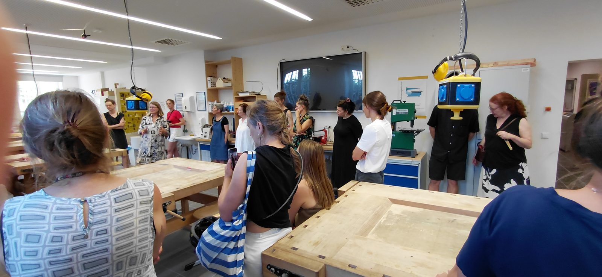
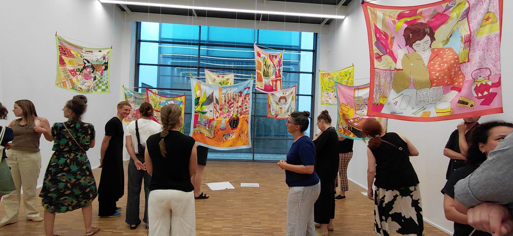
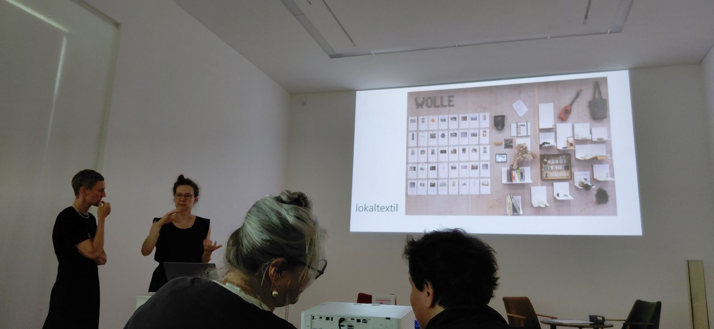
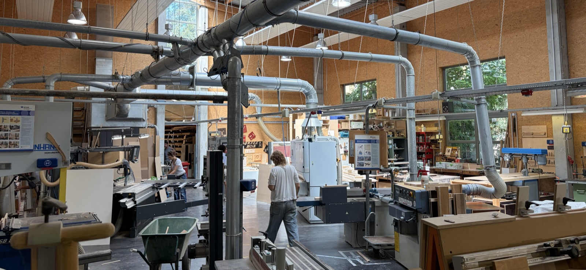
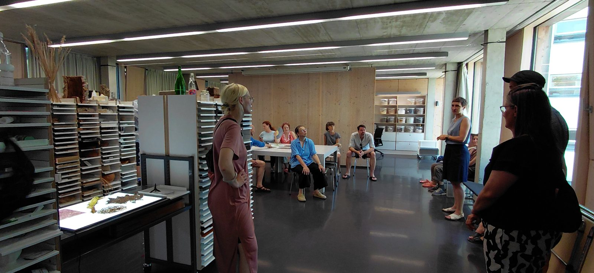
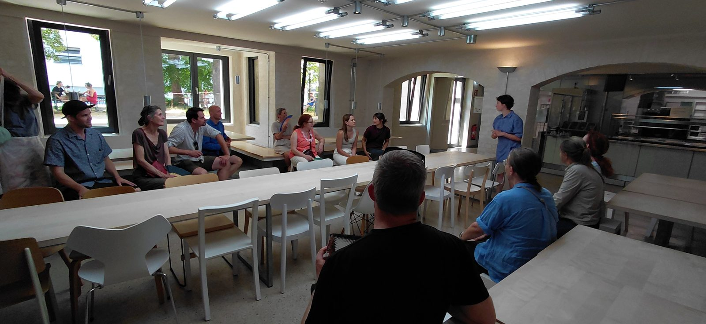
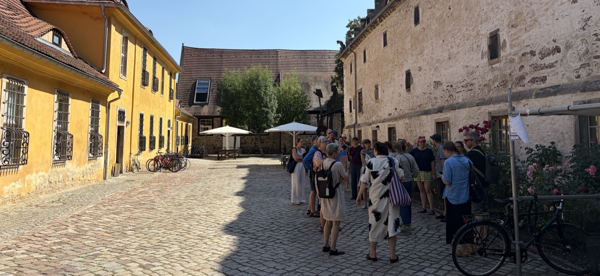
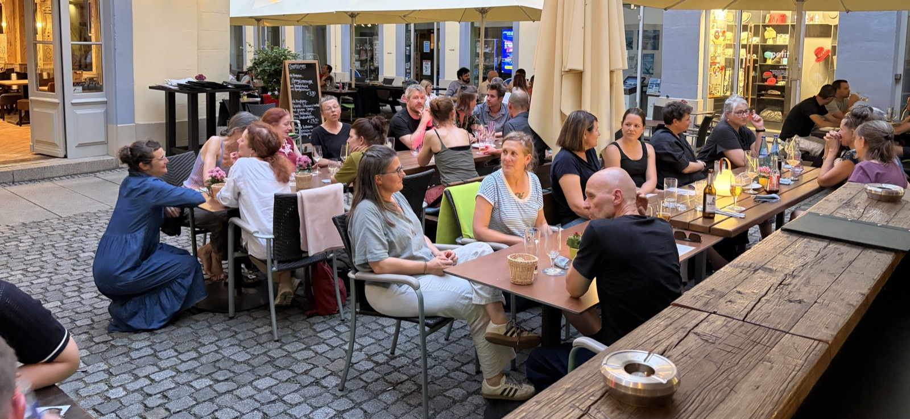

Vom 24. bis 26. Juni 2026 nahmen 25 Mitglieder der Arbeitsgruppe Design und Technik der Schweizerischen Gesellschaft für Lehrerinnen- und Lehrerbildung (SGL) aus acht Pädagogischen Hochschulen der Deutschschweiz an einer Studienreise nach Leipzig teil.

## Universität Leipzig

Die Fachkolleginnen der Grundschuldidaktik im Fachbereich Werken der Universität Leipzig, wo auch Werken für das Lehramt studiert werden kann, empfingen uns herzlich. Anhand von Studierendenarbeiten, Modulunterlagen und Hospitationen ergaben sich vielfältige Einblicke in Themen, Zugänge und Rahmenbedingungen des fachspezifischen Studiums. In einer Fach-Community-Diskussion zu Aufgabenkultur, Interdisziplinarität und Fachverständnis vertieften wir den Austausch. Die Reise setzte damit den laufenden fachdidaktischen Dialog fort, zuletzt geführt an den Leipziger Werktagen und der Internationalen Tagung Fachdidaktik TTG-D im Mai 2026 an der PHBern. Dabei zeigte sich: Im Unterricht beobachten wir viele Parallelen, und auch die Herausforderungen ähneln sich über die Landesgrenze hinweg.

::: {.content-visible when-format="pptx"}

---

:::

## Lokal Textil und Burg Giebichenstein

In der Leipziger Galerie für Zeitgenössische Kunst stellte die Initiative Lokal Textil ihre Arbeit zum Erhalt regionaler, nachhaltiger Textilproduktion und zur Vermittlung textilen Wissens vor. Die Ausstellung «Knoten der Zeit» gab Impulse für den Workshop zum Ästhetischen Forschen.

::: {.content-hidden when-format="pptx"}
::: {layout-ncol=2}

:::
:::

::: {.content-visible when-format="pptx"}

---

---

---

:::

Zum Abschluss waren wir zu Gast an der Kunsthochschule Burg Giebichenstein in Halle, 1915 gegründet und mit rund 1000 Studierenden in den Fachbereichen Kunst und Design eine der grössten Kunsthochschulen Deutschlands. Am Campus Design öffneten sich uns die Werkstätten für Produktdesign und die Materialsammlung. Ein Rundgang am Campus Kunst mit Schwerpunkt Plastik und Keramik rundete die Reise ab.

::: {.content-hidden when-format="pptx"}
::: {layout-ncol=2}

:::
:::

::: {.content-visible when-format="pptx"}

---

---

---

---

:::

## Vernetzung und Ausblick

Ebenso wertvoll wie das Programm war die Vernetzung, gerade auch zwischen den Schweizer Hochschulen. Die vielen informellen Gespräche werden ihre Spuren hinterlassen: So kristallisierte sich heraus, dass wir uns auf Fachebene dringend vertieft mit KI in der Lehre auseinandersetzen müssen. Diesen Faden nehmen wir an der Herbsttagung 2026 auf. Aufgeworfen wurden zudem Fragen zur Zukunft des Fachs TTG und zu seiner Aussenwahrnehmung.

::: {.content-visible when-format="pptx"}

---

:::

::: {.content-visible when-format="pptx"}

---

:::

Das kollegiale Miteinander ist eine Qualität, die wir sehr schätzen und die auch das Leipziger Team wahrgenommen hat.
